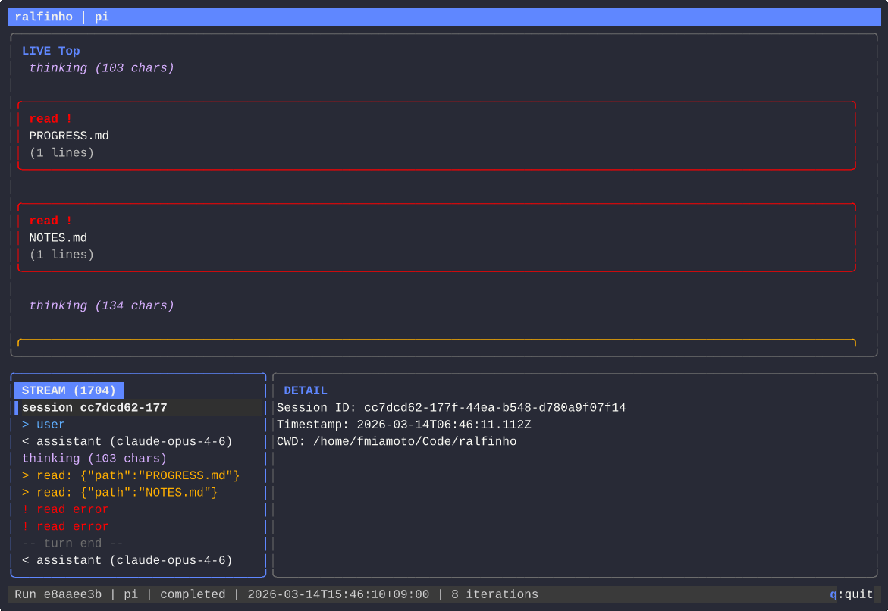

# Ralfinho

My take on the [Ralph Wiggum](https://ghuntley.com/ralph/) technique.

> _Aren't there already one hundred million tools for doing this?_
>
> Yes, but what do I learn by just using those?
>
> Paraphrashing [pi](https://pi.dev): There are many Ralphs out there, but this one is mine.

<p align="center">
  
</p>

## Installation

```bash
go install github.com/fsmiamoto/ralfinho/cmd/ralfinho@latest
```

Or install from source:

```bash
just install
```

## Usage

### Run with a prompt file

```bash
ralfinho prompt.md
ralfinho --prompt prompt.md
```

### Run with a plan file (template-based prompt)

```bash
ralfinho --plan PLAN.md
```

### Default behavior

If no prompt or plan is given, ralfinho looks for `./PLAN.md`. If found, it uses
that as the plan. Otherwise it runs with a minimal default prompt.

### Options

```
--prompt <file>           Explicit prompt file
--plan <file>             Plan file (generates prompt from template)
-a, --agent <name>        Agent backend: "pi" or "kiro" (default: pi)
-m, --max-iterations <n>  Max iterations, 0=unlimited (default: 0)
--no-tui                  Disable TUI, plain stderr output
--runs-dir <path>         Runs directory (default: .ralfinho/runs)
```

### Browse and manage past runs

```bash
ralfinho view              # Open session browser TUI (interactive terminals)
ralfinho view <run-id>     # Replay a specific run (supports prefix matching)
ralfinho view --no-tui     # Plain text listing (also used in non-TTY environments)
```

On interactive terminals, `ralfinho view` opens a full-screen session browser
with a sessions list and a metadata preview pane. Sessions are shown newest-first
by default. Runs with missing or corrupt artifacts are included but marked with a
⚠ warning indicator.

**Session browser keybindings:**

| Key | Action |
|-----|--------|
| `j`/`k`, arrows | Navigate sessions |
| `Enter`, `o` | Open selected session in the replay viewer |
| `r` | Resume: start a new run from the session's saved prompt |
| `x` | Delete selected session (requires confirmation) |
| `Tab` | Switch focus between sessions and preview panes |
| `s` | Cycle sort: newest → oldest → run ID → agent → status → prompt |
| `/` | Search sessions (free text across all fields) |
| `a`/`t`/`p`/`d` | Cycle filter by agent / status / prompt source / date |
| `c` | Clear all active filters and search |
| `g`/`G` | Jump to first / last session |
| `Ctrl+d`/`Ctrl+u` | Half-page down / up |
| `q`, `Esc` | Quit browser |

**Non-TTY fallback:** When stdin or stdout is not a terminal (e.g. piped output
or CI), or when `--no-tui` is passed, `ralfinho view` falls back to a plain text
listing of all runs.

## Agent Backends

Ralfinho supports multiple AI agent backends via the `--agent` flag. Each
backend communicates with its respective CLI tool and translates events into a
common format for the TUI and run artifacts.

### pi (default)

The default backend. Uses the [pi](https://pi.dev) CLI tool, communicating via
JSONL over stdout.

```bash
ralfinho --plan PLAN.md                # uses pi by default
ralfinho --agent pi --plan PLAN.md     # explicit
```

**Prerequisites:** `pi` must be installed and available in your `PATH`.

### kiro

Uses [kiro-cli](https://kiro.dev) via the
[Agent Client Protocol (ACP)](https://kiro.dev/docs/cli/acp/) — a
JSON-RPC 2.0 protocol over stdin/stdout.

```bash
ralfinho --agent kiro --plan PLAN.md
```

**Prerequisites:**
- `kiro-cli` must be installed and available in your `PATH`. See
  https://kiro.dev/cli/ for installation instructions.
- You must be authenticated (`kiro-cli auth login`).

**Behavioral differences from pi:**
- Tool permissions are auto-approved (`allow_always`) — ralfinho assumes
  sandboxing is handled externally.
- Each iteration spawns a fresh `kiro-cli acp` subprocess (same one-shot model
  as pi).
- The model name in events is reported as `"kiro"` since the ACP protocol does
  not expose the underlying model.
- Run artifacts (`events.jsonl`, `session.log`, `meta.json`) are populated
  identically to pi runs. `raw-output.log` contains raw JSON-RPC frames instead
  of JSONL.

## Run Artifacts

Each run is saved to `.ralfinho/runs/<uuid>/`:

- `meta.json` — run metadata (status, agent, iterations, timing)
- `events.jsonl` — raw event stream from the agent
- `effective-prompt.md` — the prompt that was sent
- `session.log` — human-readable timestamped log
- `raw-output.log` — raw agent stdout
